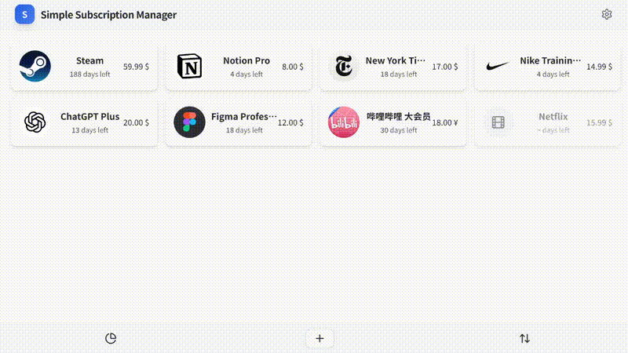

# Simple Subscription Manager

*A minimalist, fully client-side app for tracking recurring expenses.*

> Responsive • Drag-and-drop cards • Multi-currency • Multi-language

🌍 **Other Languages:** [简体中文](docs/README.zh-CN.md) • [日本語](docs/README.ja.md)

---

## 📖 Table of Contents
- [Simple Subscription Manager](#simple-subscription-manager)
  - [📖 Table of Contents](#-table-of-contents)
  - [🌐 Live Demo](#-live-demo)
  - [✨ Features](#-features)
  - [🛠️ Tech Stack](#️-tech-stack)
  - [🚀 Quick Start](#-quick-start)
  - [📈 Roadmap](#-roadmap)
  - [🤝 Contributing](#-contributing)
  - [📄 License](#-license)

---

## 🌐 Live Demo
> [Link](https://minimal-subscription-manager.vercel.app/)

<p align="center">
  
</p>


## ✨ Features
- **Responsive design** – works on desktop and mobile.
- **Drag-and-drop card sorting** for quick manual re-ordering.
- **Automatic renewal processing** – cycles are auto-extended when due (user notifications coming soon).
- **Monthly / yearly statistics** with pie charts & total cost, grouped by *category* or *subscription*.
- **Filter & sort** by status, price, date, category, etc.
- **Light / dark themes** & optional card background colours.
- **i18n:** English, 简体中文, 日本語.
- **Default currency selector** – pick from 21 ISO-4217 currencies.
- **Three billing cycles**: daily, monthly, yearly.
- **Import / export** JSON data for easy backup & migration.


## 🛠️ Tech Stack
| Purpose | Library |
|---------|---------|
| UI / Framework | React 18 + TypeScript |
| Build tool     | Vite |
| Styling        | Tailwind CSS ＋ shadcn/ui |
| Drag-and-drop  | dnd-kit |
| Charts         | Recharts |
| Forms & schema | React-Hook-Form + Zod |
| Components     | Radix UI primitives |
| Misc. utils    | currency-symbol-map, nanoid, lucide-react, etc. |

## 🚀 Quick Start
```bash
git clone https://github.com/aron5055/minimal-subscription-manager.git
cd minimal-subscription-manager
npm install          # or npm / yarn
npm dev              # http://localhost:5173
npm build            # production
npm preview          # optional preview
```
> Requirements Node 18+ and a modern browser.

## 📈 Roadmap
- User notifications for upcoming renewals
- Upload Custom Icons
- Cloud sync (optional)
- PWA installability
- More granular permissions & roles

## 🤝 Contributing
Issues and PRs are welcome! Please open an issue first if you plan a large change.

## 📄 License
MIT © 2025 Aron (see LICENSE).